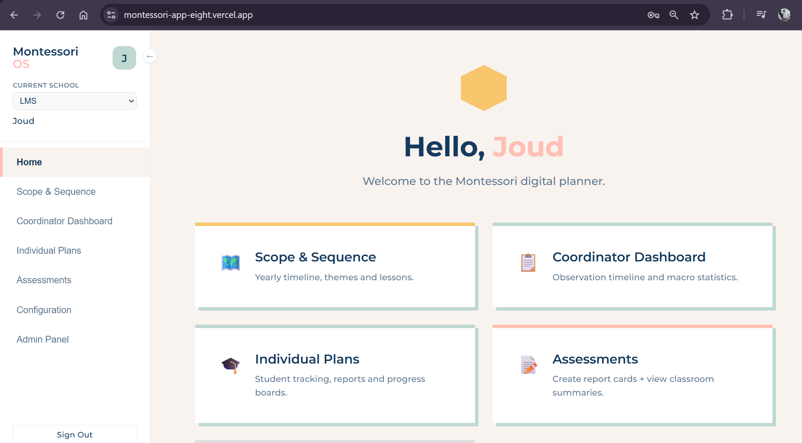
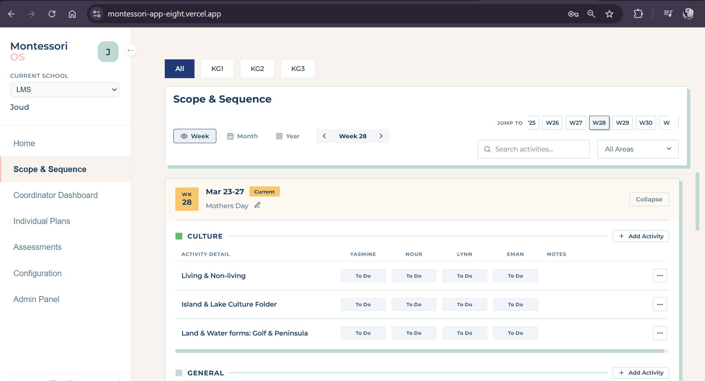
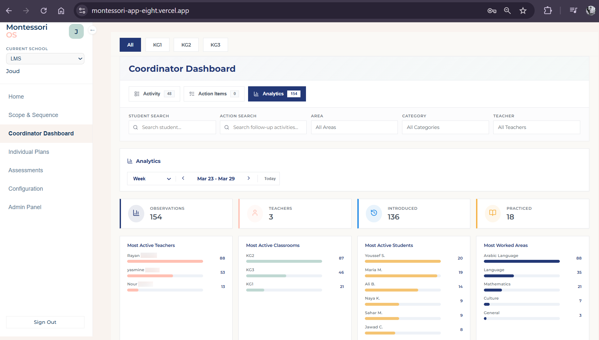
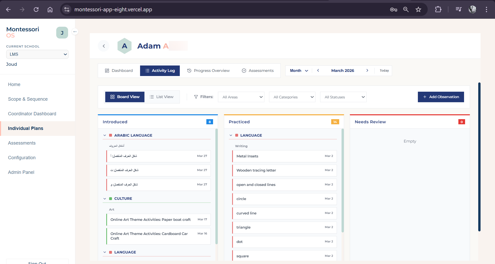
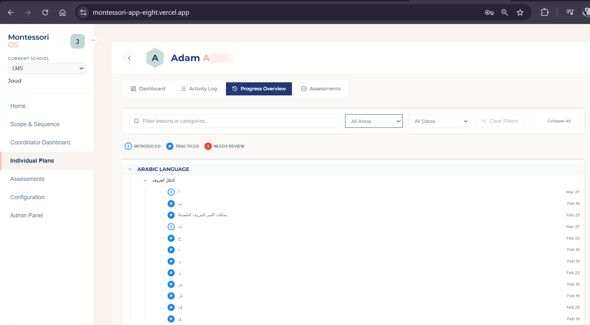
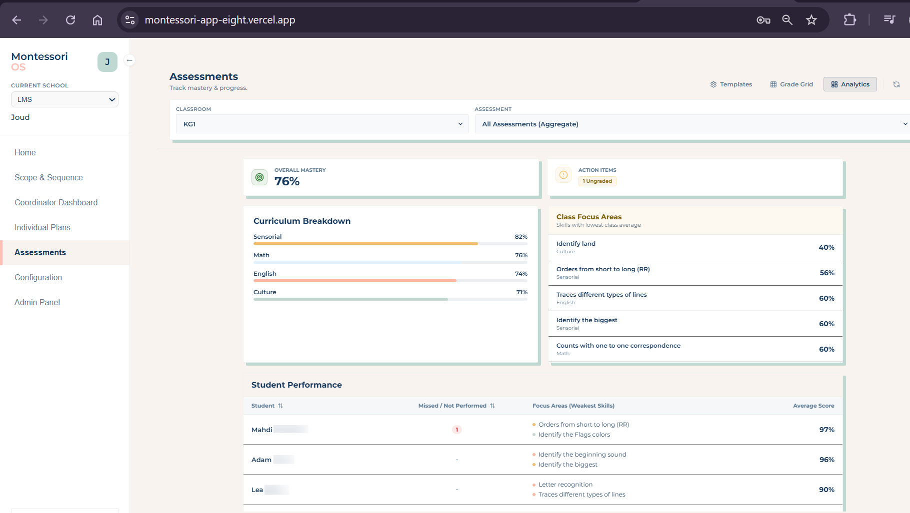
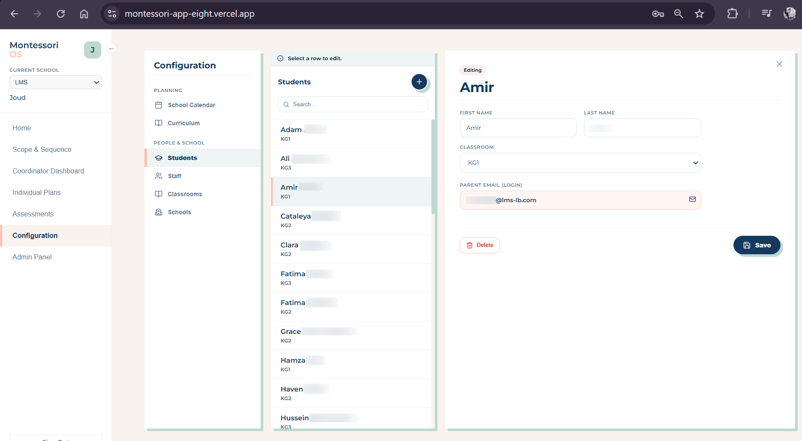
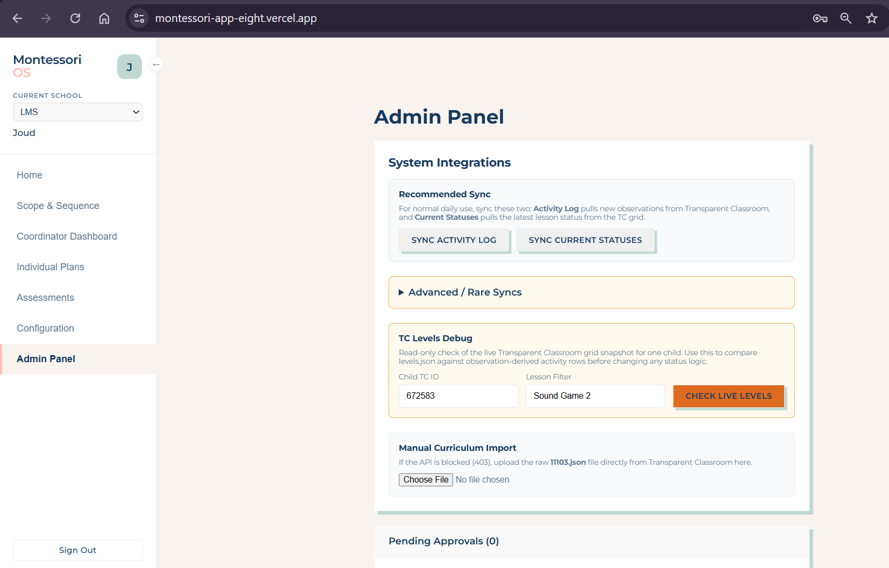

# Montessori OS

Montessori OS is a planning, progress review, and classroom operations platform for Montessori schools, built to replace fragmented manual workflows with a more structured operational system.

I started this project after seeing how much work at a partner Montessori school in Lebanon was still being handled through scattered Word documents, ad hoc planning habits, and a legacy school tool that did not support flexible classroom planning well. The school already used Transparent Classroom, but important workflows were still hard to manage, difficult to standardize, and too dependent on manual coordination.

This project is my attempt to build a modern operational layer around those workflows: one that supports teachers, coordinators, administrators, and eventually parents through clearer planning, individualized follow-through, stronger visibility, better analytics, and cleaner data flow.

## Problem Context

The original pain points were operational, not purely technical:

- planning lived across disconnected documents and informal teacher processes
- it was hard to get a clear view of what had been presented, practiced, or mastered
- coordination across classrooms was manual and time-consuming
- staff needed a more flexible workflow than the existing legacy platform offered
- school data existed, but the usability around it was weak

The goal of Montessori OS is not to replace school expertise. It is to reduce friction around that expertise by giving the school a more usable system for planning, tracking, coordination, and communication.

## Product Goal

The first phase of the product is focused on internal school operations and instructional decision support:

- daily and long-range planning
- student-level visibility
- individualized student tailoring
- progress review and mastery tracking
- coordinator oversight
- assessments and reporting
- analytics and follow-up extraction and review logic
- configuration and admin workflows
- integration with school data from Transparent Classroom

The longer-term direction is to extend the system beyond staff operations into a broader parent and school community experience once the internal workflows are stable.

## Live Demo

Live app: [montessori-app-eight.vercel.app](https://montessori-app-eight.vercel.app)

This project uses authentication and a configured backend, so some workflows are best understood through the screenshots below.

## What This Repo Demonstrates

This repository is important to me because it shows more than UI work. It reflects:

- product thinking around a messy real-world workflow
- translating operational pain points into application structure
- role-aware workflow design
- frontend architecture across multiple business views
- integration with external school data systems
- practical data modeling and operational sync logic
- normalization and structuring of messy real-world data
- logic for turning raw observations into more usable insight

## Application Overview

The app is a React + Vite frontend backed by Supabase. It loads school, classroom, student, curriculum, term plan, and planning data, then exposes different workflows depending on the user role.

At a high level, the app supports:

- authenticated access
- role-based navigation
- school switching
- curriculum-aware planning
- student-level tracking
- student-specific progress review
- individualized instructional follow-up
- class and coordination dashboards
- assessment entry and analytics
- observation review and action-item extraction
- smart matching and normalization workflows
- configuration management
- admin syncing and approvals

## Roles And Access Model

The application includes role-aware behavior for different users:

- teachers use planning and student tracking workflows
- coordinators get access to the coordinator dashboard
- supervisors and super admins get configuration and admin-level control
- parents can be locked to a specific student context
- pending users are held in an approval state before full access

This matters because the app is not a generic dashboard. It is intentionally shaped around real responsibilities inside a school.

## Main Views And Their Purpose

The app navigation is organized around distinct operational jobs:

### Home

The home screen acts as the operational landing page. It routes users into the main working areas of the application and makes the product feel like a system of workflows rather than a single monolithic screen.

### Scope & Sequence

This view is implemented through the master timeline and acts as the long-range planning layer.

Its purpose is to:

- organize planning across week, month, and year views
- manage term plans and plan sessions
- support classroom filtering
- structure the academic sequence over time
- maintain visibility into themes, lessons, and planned sessions

This is the macro planning view of the product.

### Coordinator Dashboard

This view is implemented through the activity timeline and is aimed at coordinator-level oversight.

Its purpose is to:

- show activity history and operational context
- surface follow-up items and action items
- summarize class-level work
- support coordination across teachers and classrooms
- bridge day-to-day activity with higher-level visibility

This is the view that turns a collection of teacher actions into something a coordinator can actually monitor.

### Individual Plans

This is one of the most important parts of the app and is built around the student as the core unit.

It includes:

- dashboard view
- activity log
- progress overview
- assessments
- board and list layouts
- student focus and insight panels
- follow-up items
- observation entry
- action item entry
- class filtering and student selection

This view is where planning becomes actionable at the individual-child level. It is not just a profile page; it is a working surface for tracking progress, planning next steps, and keeping instructional context organized.

It is also one of the clearest examples of how the app supports individual tailoring rather than one-size-fits-all classroom planning.

### Assessments

The assessments module includes multiple modes, including:

- templates
- grade grid
- analytics

Its purpose is to:

- manage assessment structures
- capture and review scores
- summarize classroom-level outcomes
- support reporting
- enable exports for analysis

This is the app’s most explicitly evaluation-oriented workflow and one of the clearest examples of structured data entry turning into usable reporting.

The analytics layer is especially important here because it moves the product beyond storage into review, interpretation, and decision support.

### Configuration

The configuration area manages the school’s operating structure and reference data.

It includes tabs for:

- school calendar
- curriculum
- students
- staff
- classrooms
- schools

This matters because planning systems only work if the underlying structure is configurable. This part of the app supports maintaining the operational foundation the rest of the product depends on.

### Admin Panel

The admin area handles higher-trust operational and integration tasks.

From the codebase, this includes:

- approving pending users
- syncing students and parent information
- syncing Transparent Classroom levels
- syncing activity history
- syncing parsed observation notes
- syncing grid statuses
- debugging level matches
- uploading curriculum data

This is a strong example of how the app is not just a frontend wrapper. It includes real operational tooling and system-maintenance workflows.

## Core Workflow Themes

Across the product, several workflow themes repeat:

- planning at different levels of granularity
- tracking status progression over time
- linking curriculum structure to classroom work
- preserving teacher notes and observations
- turning raw activity into usable oversight
- supporting individualized next steps for each student
- surfacing patterns through summaries and analytics
- supporting both operational execution and management visibility

## Data Flow And Architecture

The application is backed by Supabase and uses it for:

- authentication
- profile and role management
- relational data storage
- RPC-based workflows
- edge/function invocations
- loading and mutating planning records

From the app bootstrap flow, the main data sources include:

- schools
- classrooms
- students
- curriculum activities
- curriculum areas
- curriculum categories
- term plans
- term plan sessions
- planning items

The app also includes helper logic for:

- curriculum reference enrichment
- status normalization
- week/date calculations
- subject mapping
- matching and normalization of planning records

This is one of the parts of the project I would want a reviewer to notice: the app is doing practical operational data work, not just static interface rendering.

Just as important, the backend structure is not accidental. A major part of the work here is using Supabase to normalize school data into a more usable schema so that planning, progress review, analytics, and cross-view consistency become possible.

## Integration Work

One of the central product constraints is that the school already works with Transparent Classroom. Instead of pretending that system does not exist, this project integrates around it.

The repository includes sync and mapping workflows for:

- student and parent data
- curriculum levels
- activity history
- observation notes
- grid statuses
- curriculum uploads

It also includes logic for handling ambiguity in real school data:

- normalization of naming and statuses
- curriculum reference enrichment
- matching sessions to lesson/activity records
- confidence-based mapping structures for session activity alignment
- converting inconsistent source records into usable planning and review entities

That integration layer is important because many real products are built around imperfect existing systems rather than clean-sheet environments.

## UX Approach

The product is designed around usability for non-technical staff working in a high-context environment.

Some patterns visible in the codebase:

- role-sensitive navigation
- quick-add workflows
- multiple planning views
- dense but structured operational dashboards
- timeline-based interfaces
- filtering and drill-down by classroom, student, and status
- emphasis on making planning and review tasks navigable

The UX goal is to help staff answer questions quickly:

- What was worked on?
- What still needs follow-up?
- What is this child progressing in?
- Where are the gaps?
- What should happen next?

The aim is not visual novelty for its own sake. The aim is to make a complicated workflow feel structured and manageable.

## Tech Stack

- React
- Vite
- JavaScript
- Supabase
- Lucide React
- Transparent Classroom API integration

## Smart Logic And Data Work

One of the strongest parts of this project is that it does not stop at CRUD screens.

The codebase includes logic for:

- normalizing statuses and activity labels across inconsistent source data
- enriching planning items with curriculum references
- grouping classroom activity into coordinator-facing summaries
- surfacing action items and follow-ups from observations
- generating student-level progress views across multiple data sources
- aggregating assessment results into classroom analytics
- matching sessions and lesson/activity records using scoring logic rather than naive string equality
- supporting confidence-based mapping structures in the database for reviewed matches

This matters because the product is trying to make school data more useful, not just more visible.

## Database And Data Modeling

Supabase is not only used as a generic backend. It is part of the product’s core value.

The database layer helps:

- structure operational school data into clearer entities
- normalize imported and synced records
- support role-aware application behavior
- power planning, assessment, and analytics views from shared data models
- create a more coherent internal system than the fragmented source workflow

The SQL and sync-related work in this repository reflects that the backend is being shaped intentionally to support real application logic, not just to persist forms.

## Repository Structure

```text
src/
  components/
    ui/              Reusable UI building blocks
    business/        Domain-specific workflow components
  context/           Authentication and session state
  ui/                Theme and presentation system
  utils/             Shared helpers, normalization, matching logic
  views/             Main application modules and operational screens
  supabaseClient.js  Supabase client setup
supabase/
  sql/               Database-related scripts and schema helpers
scripts/             Local support scripts for integration and data work
```

## Local Development

### Prerequisites

- Node.js 18+
- npm
- a Supabase project
- environment variables for Supabase
- any credentials/configuration required for external integration workflows

### Install dependencies

```bash
npm install
```

### Start the app

```bash
npm run dev
```

### Build for production

```bash
npm run build
```

### Lint

```bash
npm run lint
```

## Demo And Review Notes

This app currently depends on authentication and a configured backend environment, so some workflows are not fully reviewable from the repository alone.

If you are reviewing this project without a live login:

- the best way to understand it is to look at the main views and their responsibilities
- screenshots are useful because several important workflows are behind authenticated access
- some features depend on Supabase data and external sync processes
- the repository is best read as an active product build, not as a polished template or toy app

## Screenshots

The application is authenticated and backend-connected, so screenshots are the fastest way to understand the product surface and workflow structure.

### 1. Home


*Operational landing page routing users into the platform’s main workflows, including planning, coordination, student tracking, assessments, configuration, and administration.*

### 2. Scope & Sequence


*Long-range planning view used to organize themes, lessons, and sessions across weekly, monthly, and yearly timelines.*

### 3. Coordinator Dashboard


*Coordinator-facing analytics and oversight view summarizing classroom activity, action items, teacher activity, and cross-classroom operational patterns.*

### 4. Individual Plans - Kanban


*Board-based workflow for tracking presented, practiced, and review-needed activities in a structured format that supports individualized follow-through.*

### 5. Individual Plans - Progress Overview


*Progress review layer showing curriculum-level tracking and longitudinal skill progression for an individual student.*

### 6. Assessments - Analytics


*Assessment analytics view turning grade and progress data into classroom-level summaries, focus areas, and performance insights.*

### 7. Configuration


*Configuration workflows for managing operational school structure, including students and other reference data the platform depends on.*

### 8. Admin Panel


*Administrative workflows for sync operations, approvals, debugging, and higher-trust maintenance tasks that support the system’s integration and data quality.*

## Current Status

This is an active in-progress product. The core architecture, multi-view workflow structure, analytics layer, smart matching logic, and integration backbone are already in place. Ongoing work includes refining data quality, continuing workflow polish, strengthening presentation, and expanding the product toward broader school and parent use cases.

## Why This Project Matters

If you are reviewing this repository as part of a job application, the most relevant signal is not that the domain is education. The relevant signal is that this project shows how I approach:

- ambiguous real-world problems
- workflow-heavy product design
- structured thinking
- operational tooling
- data-backed application logic
- normalization and modeling of messy source data
- building intelligent workflow support instead of passive screens
- building around constraints instead of ignoring them

## License

This repository is currently shared as a portfolio and demonstration project.
